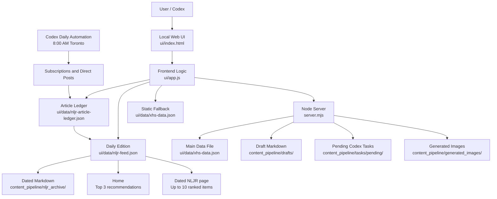

# Architecture

## Overview

The current architecture is local-first and file-first.



## Runtime Components

There is one local server in the current architecture. It serves both the frontend and the backend API.

### Node Server

File:

- `server.mjs`

Responsibilities:

- Serve the local UI.
- Serve static files.
- Read and write `ui/data/xhs-data.json`.
- Update topic status.
- Add selected topics into the post list.
- Store selected visual option decisions.
- Create pending Codex tasks when direct generation is not available.
- Optionally call the OpenAI image generation API when `OPENAI_API_KEY` is set.

Default URL:

- `http://127.0.0.1:5177/ui/index.html`

LAN URL for another trusted device on the same Wi-Fi:

- `http://<your-lan-ip>:5177/ui/index.html`

The server binds to `0.0.0.0` so LAN access is possible. Windows Firewall may still need an inbound private-network TCP rule for port `5177`.

Default port:

- `5177`

Override:

```bash
PORT=5180 npm run dev
```

Health check:

- `http://127.0.0.1:5177/api/health`
- `http://<your-lan-ip>:5177/api/health`

Expected response:

```json
{
  "ok": true
}
```

### Fallback Local Test Server

File:

- `scripts/local_test_server.py`

Command:

```bash
npm run dev:fallback
```

Use this only when the normal Node server cannot start in the Codex/Windows sandbox because Node cannot resolve the ESM `server.mjs` path. The fallback server serves the same frontend and key local write APIs for Topic List testing:

- `/api/health`
- `/api/data`
- `/api/topics/status`
- `/api/topics/add-to-posts`
- `/api/visual-option`

Keep the terminal window open while testing.

### Frontend UI

Files:

- `ui/index.html`
- `ui/app.js`
- `ui/styles.css`

Responsibilities:

- Render Home, Topics, Drafts, Posts, NLJR Console, dated NLJR editions,
  Image Style, and Strategy pages.
- Keep the Home NLJR limited to three deep recommendations.
- Render the full dated NLJR with up to ten ranked items.
- Load real project data.
- Render Markdown previews in modals.
- Let the user select topics, update statuses, and inspect post pipeline assets.
- Trigger backend actions when running through the Node server.

### Data Layer

There is no database.

The primary structured data store is:

- `ui/data/xhs-data.json`

NLJR state is stored separately:

- `ui/data/source-registry.json`
- `ui/data/nljr-feed.json`
- `ui/data/nljr-article-ledger.json`

Large text content stays as Markdown:

- `content_pipeline/drafts/`
- `content_pipeline/templates/`
- `ui/data/pipeline/`
- `ui/data/templates/`

Performance is currently CSV:

- `performance/post_metrics.csv`

## API Routes

| Route | Method | Purpose |
|---|---:|---|
| `/api/health` | GET | Confirms the local server is running. |
| `/api/data` | GET | Returns `ui/data/xhs-data.json`. |
| `/api/source-registry` | GET | Returns NLJR source and scan-state records. |
| `/api/nljr-feed` | GET | Returns the current dated NLJR edition and archive index. |
| `/api/nljr-article-ledger` | GET | Returns article discovery and deduplication history. |
| `/api/nljr-feed/generate` | POST | Builds an edition from already discovered `new` ledger items; live research is normally performed by Codex automation. |
| `/api/topics/status` | POST | Updates a topic status: `funnel`, `selected`, or `cancelled`. |
| `/api/topics/add-to-posts` | POST | Marks a topic as selected and creates/returns a post pipeline item. |
| `/api/posts/cancel` | POST | Archives a post draft and returns the linked topic to `funnel`. |
| `/api/generate-draft` | POST | Generates publish copy and copy review from the post brief. The post stays `Added` until the draft is accepted. |
| `/api/drafts/accept` | POST | Marks the draft as accepted and sets the post status to `Drafted`. |
| `/api/visual-option` | POST | Saves the chosen visual direction for a post. |
| `/api/generate-image-prompts` | POST | Marks image prompts ready or creates a Codex task if prompts are missing. |
| `/api/generate-images` | POST | Generates image files if API key exists, otherwise creates a Codex task. |
| `/api/image-workflow/carousel-script` | POST | Writes the unified Generate Image carousel script asset. |
| `/api/image-workflow/image-prompts` | POST | Writes all image prompts after carousel script acceptance. |
| `/api/image-workflow/generate-images` | POST | Generates image files; without an API key, writes local SVG carousel images. |
| `/api/image-workflow/accept-package` | POST | Saves the Ready package and sets post status to `Ready`. |

## Static Fallback Behavior

The UI tries to load data from:

1. `/api/data`
2. `./data/xhs-data.json`
3. `/data/xhs-data.json`
4. `ui/data/xhs-data.json`
5. `/ui/data/xhs-data.json`

If the backend is not running, the UI can still display static data. Mutations such as updating topic status or adding to posts only persist when the Node server is running.

Recommended startup sequence:

1. Open a terminal in the project root.
2. Run `npm run dev`.
3. Confirm `/api/health` returns `{ "ok": true }`.
4. Open `/ui/index.html` in the browser.
5. Make workflow changes only after the backend is confirmed running.

Operational rule:

> Any real workflow action must be written back to project files. If the local backend is not running, the UI should not pretend that the action was saved.

Examples of real workflow actions:

- Selecting a topic.
- Marking a topic as `cancelled`.
- Adding a topic to Posts.
- Saving a visual option.
- Creating image prompt or image generation tasks.

## Image Generation Modes

The system supports two modes.

### Codex Task Mode

If `OPENAI_API_KEY` is not set, image-related actions create task files under:

- `content_pipeline/tasks/pending/`

This is useful when Codex should later generate or process assets manually.

### OpenAI API Mode

If `OPENAI_API_KEY` is set, `/api/generate-images` calls the OpenAI image generation API and saves PNG files under:

- `content_pipeline/generated_images/{postId}/`

The default model is:

- `gpt-image-2`

Override:

```bash
OPENAI_IMAGE_MODEL=your-model npm run dev
```

## Security And Safety Notes

- `server.mjs` uses a safe path join helper to prevent serving files outside the project root.
- The app is local-first and not designed for public internet deployment.
- Do not put secrets into Markdown files or JSON data files.
- Keep API keys in environment variables only.
