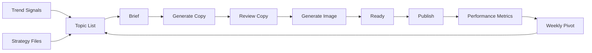

# Workflow Logic

## End-To-End Workflow

## Reusable Template Layer

Reusable templates define the repeated structure before any single post is produced.

Files:

- `content_pipeline/templates/post_brief_template.md`
- `content_pipeline/templates/carousel_script_template.md`
- `content_pipeline/templates/visual_style_options_template.md`
- `content_pipeline/templates/image_prompts_template.md`

UI copies:

- `ui/data/templates/`

Template purpose:

- Brief: define the content job, audience, pain, commercial hypothesis, and success signal.
- Carousel Script: define page-by-page logic for a XHS carousel.
- Visual Style Options: define possible visual directions before choosing one.
- Image Prompts: reusable rules for page-level prompts, now executed inside the Generate Image workflow.

## Topic Workflow

Topic sources:

- Strategy files.
- Manual trend inbox.
- XHS screenshots.
- Processed signal Markdown files.
- External trend source list.

Topic statuses:

- `funnel`: created from strategy and sources, but not yet selected.
- `selected`: chosen by the user for the post pipeline.
- `cancelled`: not suitable right now.

Topic page behavior:

1. Topics are shown in `Topic List`.
2. `selected` topics appear first.
3. `funnel` topics appear second.
4. `cancelled` topics appear last.
5. Within each status, lower `priority` appears earlier.
6. Clicking `Add` marks the topic as `selected` and adds it to Posts.
7. Clicking `Cancel` marks the topic as `cancelled`.

Backend persistence:

- Topic status is system-controlled through the `Action` column and persists only when the Node server or fallback server is running.
- The backend writes changes to `ui/data/xhs-data.json`.
- The UI must not treat temporary browser-only state as a real operating record.

Example:

If `非技术背景想转 AI PM，应该做什么 AI project？` is added to Posts, the system must write both of these changes to `ui/data/xhs-data.json`:

- The topic status becomes `selected`.
- A matching post item is added to `posts`.
- A brief Markdown file is generated and linked to the post.

## Post Pipeline Workflow

Individual post flow:

1. Topic
2. Brief
3. Generate Copy
4. Review Copy
5. Generate Image
6. Ready
7. Publish

Brief and review are different stages:

- Brief is generated when a topic is added to Post Drafts. It explains why this post is recommended, how it fits the strategy, what commercial hypothesis it tests, and what signal to watch.
- Review belongs to the draft stage. It should evaluate the generated copy after the user clicks Generate Draft.

Operational sequence:

1. Add topic to Posts.
2. System creates a brief immediately and keeps the post status as `Added`.
3. User clicks Generate Draft.
4. System reads the brief and generates both publish copy and copy review.
5. System writes `*_publish-copy.md` and `*_copy-review.md` into `content_pipeline/drafts/` and `ui/data/pipeline/`.
6. System updates the post assets and keeps status as `Added`.
7. User clicks Accept Draft.
8. System sets status to `Drafted` and records `workflowState.draftAccepted`.

Generate Draft button states:

- If the post has no draft assets yet, show `Generate Draft`.
- Once draft assets exist, show `Review Draft`.
- Once the draft is accepted, show `Draft Accepted` and move status to `Drafted`.

Post status values:

1. `Added`
2. `Drafted`
3. `Generate Image`
4. `Ready`
5. `Archived`

Archived posts are not shown by default in the Posts page. They can be shown by choosing `Archived` in the Status filter.

Post Draft cancellation:

1. User clicks `Cancel` in the Post Actions column.
2. The post draft status becomes `Archived`.
3. The linked topic status becomes `funnel`.
4. The archived post remains in the file record, but disappears from the default Post Drafts view.
5. If the user later clicks `Add` for that topic again, the system creates a new active post draft instead of reusing the archived one.

The Posts page renders active items from:

- `posts` in `ui/data/xhs-data.json`

Each post points to Markdown assets through:

- `assets`: browser-readable paths.
- `sourceAssets`: canonical project paths.

## Generate Image Workflow

After a draft is accepted, the Post Actions table shows one `Generate Image` button. This replaces the older separate `Visual Direction`, `Image Prompts`, and `Generate Image` buttons.

The popup contains:

1. `Image Required?` toggle, defaulted to yes.
2. Three post style options when images are required.
3. Multi-select goals: `点赞`, `收藏`, `Trust`, `评论`.
4. Generate Carousel Script, then review/comment/accept.
5. Generate all Image Prompts, then review/comment/accept.
6. Generate all Images, then review/comment/accept.
7. Save the Ready package, including title, body, and image list, then set status to `Ready`.

When no image API key is configured, the backend generates local SVG carousel images under `content_pipeline/generated_images/{postId}/`. This keeps the workflow fully testable without external image generation.

Current logic:

1. The user chooses image requirement, style option, and goals.
2. Backend writes the carousel script asset.
3. User reviews/comments/accepts the carousel script.
4. Backend writes all image prompts.
5. User reviews/comments/accepts the image prompts.
6. Backend generates local SVG images when no API key exists, or generated image files when image API is configured.
7. User reviews/comments/accepts the package.
8. Backend writes the Ready package and sets status to `Ready`.

The selected visual option should guide:

- Page layout.
- Color direction.
- Reference style.
- Object and scene choices.
- Whether the carousel feels like premium manual, editorial analysis, product teardown, or another style family.

## Image Prompt Workflow

Image prompts live in:

- `content_pipeline/drafts/*_image-prompts.md`

UI copy:

- `ui/data/pipeline/*_image-prompts.md`

When image prompts are ready:

- The Images action can generate images if `OPENAI_API_KEY` is available.
- Otherwise the backend creates a pending Codex task under `content_pipeline/tasks/pending/`.

Generated image output:

- `content_pipeline/generated_images/{postId}/`

## Trend Inbox Workflow

Human trend inbox is the preferred XHS signal method for now.

User action:

1. Search XHS manually on phone.
2. Upload screenshots into the project.
3. Codex renames images using English filenames.
4. Codex summarizes the screenshots into a processed signal Markdown file.
5. Useful topic candidates are added to the Topic List.

Current processed signal location:

- `trend_inbox/processed/`

## Daily NLJR

1. At 8:00 AM America/Toronto, read active subscriptions from
   `ui/data/source-registry.json`.
2. Fetch actual posts published since the previous successful check, preferring
   RSS/feed URLs and using archive pages only for direct-post discovery.
3. Normalize each direct post URL and compare it with
   `ui/data/nljr-article-ledger.json`.
4. Ignore any URL already recorded as `processed`, `skipped`, or currently
   `new`.
5. Add genuinely new direct posts to the ledger with status `new`.
6. Read eligible content and rank up to ten items by relevance.
7. Produce full analysis for the first three recommendations.
8. Produce concise scan summaries for items 4-10.
9. Write the daily feed and dated Markdown archive with separate
   `Recommended Deep Reads` and `More New Feeds` sections.
10. Mark selected ledger records `processed` with `processedAt` and
   `includedIn`.
11. Update each subscription's `scanStatus`, `lastCheckedAt`, `lastItemSeen`,
   and `lastError`.

If no new qualifying posts exist, write a valid daily feed with status
`no_new_posts` and an empty item list. Never substitute an archive page or an
old processed article.

### NLJR Editorial Standard

Discovery metadata is not editorial content. RSS descriptions, newsletter
subtitles, and calls to action such as `Watch now` or `Listen now` may help
locate a post, but they cannot be published as the NLJR summary.

Before an item is selected, read the full article or the available
video/podcast transcript and produce:

- `summary`: two to four substantive sentences covering the specific event or
  argument, how it works, and concrete evidence, examples, metrics, or outcomes.
- `whyItMatters`: two to three content-specific sentences explaining the
  reusable lesson for AI PM coaching, AI portfolio work, or AI Ops for
  non-technical business owners.
- `topicAngle`: one explicit post thesis plus the practical framing, contrast,
  checklist, or framework that can become an XHS or LinkedIn post.

For ranked items 4-10, use a faster reading format:

- `conciseSummary`: one or two substantive sentences describing the actual
  content.
- `conciseWhyRelevant`: one sentence explaining why momo should read or reuse
  it.

The Home page shows only the three deep recommendations. The dated daily NLJR
page shows those three plus the concise ranked items, up to ten total.

Reject and rewrite generic language such as `fresh signal`, `worth tracking`,
source-tag descriptions, or a restatement of the title.

Source list:

- `references/trend_source_list.md`

Chinese platform workflow:

- `references/chinese_platform_signal_workflow.md`

## Performance And Weekly Pivot

Performance data lives in:

- `performance/post_metrics.csv`

Token usage tracking lives in:

- `performance/token_usage.csv`

Token usage rule:

- Add one row for each user question or project task.
- If exact token usage is unavailable, record `unknown` rather than guessing.
- Use the notes column to explain the source of the number or why it is unavailable.

Weekly pivot logic:

1. Review the previous post's performance.
2. Look for save/comment/follow signals.
3. Compare the signal against the commercial hypothesis.
4. Decide whether to continue, refine, or abandon the content angle.
5. Update strategy or topic priority if needed.
6. Pick the next topic.

The weekly pivot should not optimize for reach alone. It should prioritize commercial learning:

- Did the post attract the right audience?
- Did people save it because it solved a real transition problem?
- Did comments reveal coaching demand?
- Did the post strengthen the AI PM coach persona?

## Strategy Versioning

Before major strategy rewrites:

1. Copy the previous version into `archive/`.
2. Use an English version folder name.
3. Update the active file in `strategy/`.

Current strategy source of truth:

- `strategy/`

Historical versions:

- `archive/`
